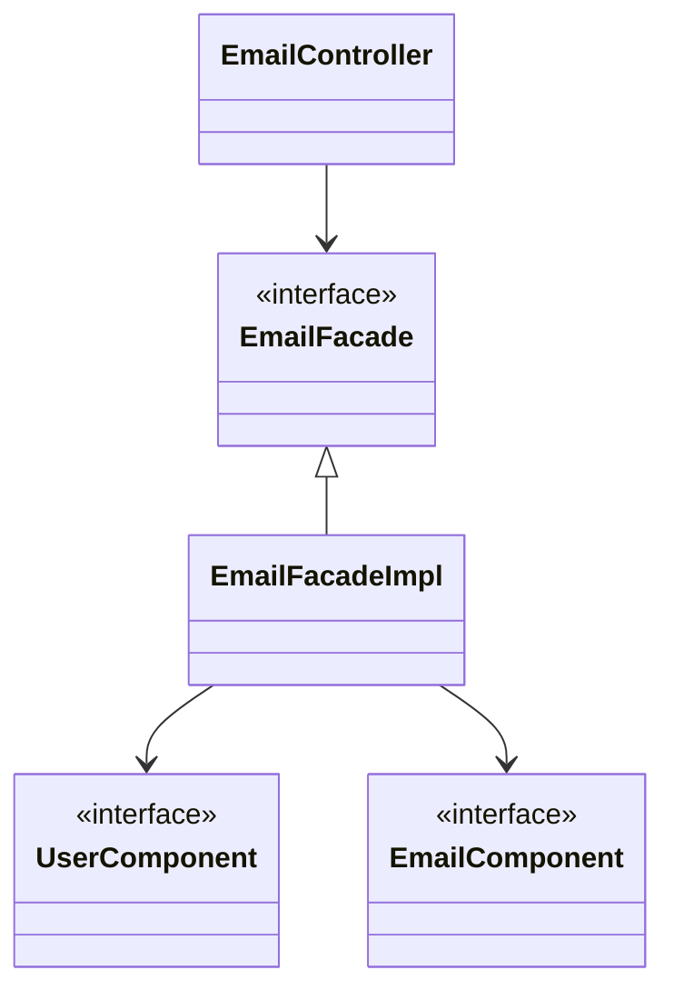

# E-COMMERCE REST API

## Como ejecutarlo

## Descripción

Este proyecto es una API REST en desarrollo para un sistema de e-commerce.

## Tecnologías

- **Java**
    - **Spring Boot**: Framework para el desarrollo de aplicaciones web.
        - **Spring Data JPA**: Framework para el mapeo objeto-relacional ( Hibernate ).
        - **Spring Security**: Modulo para la seguridad de la aplicación (Autenticación, Autorización, Vulnerabilidades,
          etc).
        - **Spring Web**: Modulo para soporte de aplicaciones web (MVC, REST, etc).
    - **Testing**
        - **JUnit**: Framework para realizar pruebas unitarias, de integración, etc.
        - **AssertJ**: Framework para realizar aserciones.
        - **Mockito**: Framework para hacer mock de dependencias.
        - **Spring Boot Test**: Framework para realizar pruebas de integración.

- **Base de datos**
    - **PostgreSQL**: RDBMS.
    - **Cloud Storage for Firebase**: Servicio cloud para almacenar archivos binarios (imagenes, videos, etc).

- **Documentación**
    - **OpenAPI Specification**: Especificación estandar para documentar APIs HTTP.

## Estructura del proyecto

### Simple

#### Modulos y su funcionalidad:

- **_bootstrapping_**:
    - Llevantamiento de la aplicacion
    - Configuracion de entornos
        - produccion
        - desarrollo
        - pruebas
    - Mapeo de codigos de error
    - Entrada y salida HTTP

- **_application_**:
    - Logica de negocio
        - Coordinacion entre los modulos (de bajo nivel)

- **_user_**:
    - Gestion de usuarios
        - Creacion
        - Actualizacion
        - Eliminacion
        - Consultas en general

- **_product_**:
    - Gestion de productos
        - Creacion
        - Actualizacion
        - Eliminacion
        - Consultas en general

- **_email_**:
    - Envio de emails
    - Gestion de codigo de verificacion

- **_security_**:
    - Autenticacion
    - Autorizacion
    - Proteccion contra vulnerabilidades
    - Gestion de sesiones

- **_payment_**:
    - Gestion de pagos
        - ~~Integracion con pasarelas de pago~~
        - Creditos internos

- **_order_**:
    - Gestion de ordenes

- **_file_**:
    - Gestion de archivos
        - imagenes
            - de productos

- **_deposit_**:
    - Gestion de depositos
        - Recarga de creditos internos por transferencia bancaria

- **_cart_**:
    - Gestion de carritos de compras

### Ejemplo de flujo de aplicacion

- Diagrama de clases de [EmailController](bootstrapping/src/main/java/org/cris6h16/Controllers/EmailController.java)

- Diagrama de clases
  de [UserController](bootstrapping/src/main/java/org/cris6h16/Controllers/UserController.java) & [AuthenticationController](bootstrapping/src/main/java/org/cris6h16/Controllers/AuthenticationController.java) (
  completo)

PD:

- Por hacerlo mas legible, Estos diagramas excluyen:
    - _DTOs_: Objetos de entrada y salida HTTP
    - _Inputs_: Objetos de entradas a componentes
    - _Outputs_:Objetos de salida de componentes

## Testing

### ENDPOINTS antes

| Path                                           | Metodo   | Descripcion                                                                                          |
|------------------------------------------------|----------|------------------------------------------------------------------------------------------------------|
| `/auth/signup`                                 | `POST`   | Crear una cuenta de usuario                                                                          |
| `/auth/login`                                  | `POST`   | Iniciar sesion  (obtener tokens de acceso)                                                       |
| `/auth/verify-email`                           | `POST`   | Verificar email ( necesario codigo de email )                                                        |
| `/auth/reset-password`                         | `POST`   | Resetar password ( necesario codigo de email )                                                       |
| `/auth/refresh-token`                          | `POST`   | refrescar token de accesso                                                                           |
| `/users/{id}`                                  | `GET`    | Obtener un usuario por id                                                                            |
| `/users/{id}/products`                         | `GET`    | Obtener productos de un usuario por id (Spring pageable), probablemente no indispensable         |
| `/users/{id}/balance`                          | `PATCH`  | Ajustar balance (sumar o restar el _delta_ (Δ))                                                      |
| `/users/{id}/authorities`                      | `PUT`    | Actualizar roles (PUT)                                                                               |
| `/carts/{id}`                                  | `GET`    | Obtener my carro de compras (NO IMPLEMENTADO AUN)                                                    |
| `/carts/{id}/items/add`                        | `POST`   | Agregar un item al carrito de ompras                                                                 |
| `/carts/{id}/items/{id}/amount`                | `PUT`    | Actualizar cantidad de un item de carrito                                                            |
| `/carts/{id}/items/{id}`                       | `DELETE` | Borrar un item de carrito                                                                            |
| `/email/send-email-verification`               | `POST`   | Enviar un email de verificacio necesario especificar que tipo de permiso se esta concediendo |
| `/payments`                                    | `POST`   | Procesar un pago                                                                                     |
| `/products/create-product`                     | `POST`   | Crear un producto                                                                                    |
| `/products/{id}`                               | `GET`    | Obteber un producto                                                                                  |
| `/products/{id}`                               | `PUT`    | actualizar un producto                                                                               |
| `/products/{id}`                               | `DELETE` | borrae un producto                                                                                   |
| `/products/categories//create-category`        | `POST`   | crear categoria                                                                                      |
| `/products/categories`                         | `GET`    | obtener categoria ( no pageable )                                                                    |
| `/products` `?page=0&size=10&sort=id,desc` | `GET`    | Obtener todos los productos (Spring pageable)                                                    |

DOCS INCOMPLETOS desde aqui

## Dudas que probablemente tengas

### Aplicación

1. ¿Porque no se integra con pasarelas de pago?   
   // todo: explicar: necesito ruc, hisotrial crediticio, bancos internacionales(strype), mesualidad

2. ¿Si no se integram pasarelas de pago como se realizan los pagos?
   // explcair creditos internos de app

3. como integrar asarelas de pago
   // todo: explicar extension de la clase abstracta base y impl en el componente mediante una interface

### Desarrollo

## Acerca del autor