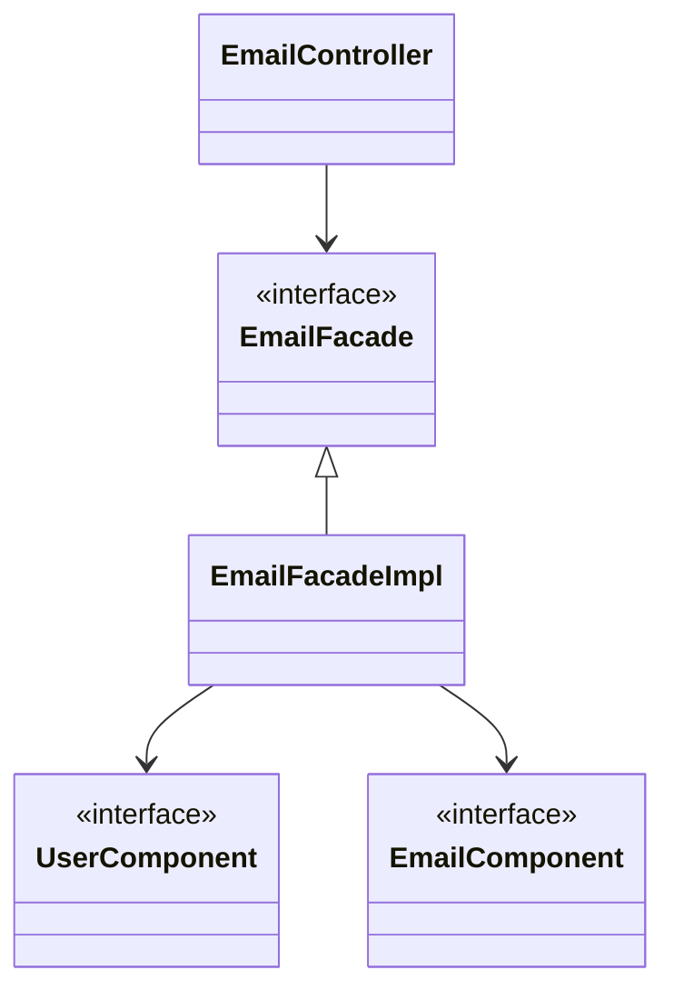
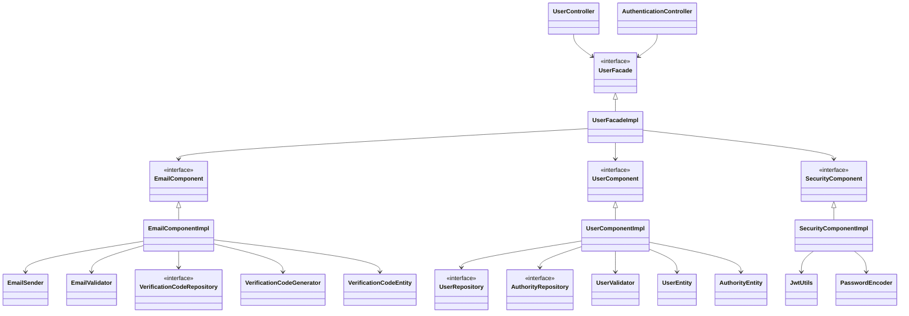

# E-COMMERCE REST API

## Como ejecutarlo

## Descripción

Este proyecto es una API REST en desarrollo para un sistema de e-commerce.

## Tecnologías

- **Java**
    - **Spring Boot**: Framework para el desarrollo de aplicaciones web.
        - **Spring Data JPA**: Framework para el mapeo objeto-relacional ( Hibernate ).
        - **Spring Security**: Modulo para la seguridad de la aplicación (Autenticación, Autorización, Vulnerabilidades,
          etc).
        - **Spring Web**: Modulo para soporte de aplicaciones web (MVC, REST, etc).
    - **Testing**
        - **JUnit**: Framework para realizar pruebas unitarias, de integración, etc.
        - **AssertJ**: Framework para realizar aserciones.
        - **Mockito**: Framework para hacer mock de dependencias.
        - **Spring Boot Test**: Framework para realizar pruebas de integración.

- **Base de datos**
    - **PostgreSQL**: RDBMS.
    - **Cloud Storage for Firebase**: Servicio cloud para almacenar archivos binarios (imagenes, videos, etc).

- **Documentación**
    - **OpenAPI Specification**: Especificación estandar para documentar APIs HTTP.

## Estructura del proyecto

### Simple

#### Modulos y su funcionalidad:

- **_bootstrapping_**:
    - Llevantamiento de la aplicacion
    - Configuracion de entornos
        - produccion
        - desarrollo
        - pruebas
    - Mapeo de codigos de error
    - Entrada y salida HTTP
    - Pruebas Funcionales

- **_application_**:
    - Logica de negocio
        - Coordinacion entre los modulos (de bajo nivel)

- **_user_**:
    - Gestion de usuarios
        - Creacion
        - Actualizacion
        - Eliminacion
        - Consultas en general

- **_product_**:
    - Gestion de productos
        - Creacion
        - Actualizacion
        - Eliminacion
        - Consultas en general

- **_email_**:
    - Envio de emails
    - Gestion de codigo de verificacion

- **_security_**:
    - Autenticacion
    - Autorizacion
    - Proteccion contra vulnerabilidades
    - Gestion de sesiones

- **_payment_**:
    - Gestion de pagos
        - ~~Integracion con pasarelas de pago~~
        - Creditos internos

- **_order_**:
    - Gestion de ordenes

- **_file_**:
    - Gestion de archivos
        - imagenes
            - de productos

- **_deposit_**:
    - Gestion de depositos
        - Recarga de creditos internos por transferencia bancaria

- **_cart_**:
    - Gestion de carritos de compras

### Ejemplo de flujo de aplicacion

- Diagrama de clases de [EmailController](bootstrapping/src/main/java/org/cris6h16/Controllers/EmailController.java)

- Diagrama de clases
  de [UserController](bootstrapping/src/main/java/org/cris6h16/Controllers/UserController.java) & [AuthenticationController](bootstrapping/src/main/java/org/cris6h16/Controllers/AuthenticationController.java) (
  completo)

PD:

- Por hacerlo mas legible, Estos diagramas excluyen:
    - _DTOs_: Objetos de entrada y salida HTTP
    - _Inputs_: Objetos de entradas a componentes
    - _Outputs_:Objetos de salida de componentes

## Requisitos Funcionales

DOCS INCOMPLETOS desde aqui

## Dudas que probablemente tengas

### Aplicación

1. ¿Porque no se integra con pasarelas de pago?   
   // todo: explicar: necesito ruc, hisotrial crediticio, bancos internacionales(strype), mesualidad

2. ¿Si no se integram pasarelas de pago como se realizan los pagos?
   // explcair creditos internos de app

3. como integrar asarelas de pago
   // todo: explicar extension de la clase abstracta base y impl en el componente mediante una interface

### Desarrollo

## Acerca del autor

<ul _ngcontent-ktg-c330=""><li _ngcontent-ktg-c330="" class="question-card ng-star-inserted"><mat-card _ngcontent-ktg-c330="" class="mat-card mat-focus-indicator question" >
Pregunta 1
<label _ngcontent-ktg-c330=""  for="Selecciona tres aplicaciones de los algoritmos hash en el almacenamiento online.">Selecciona tres aplicaciones de los algoritmos hash en el almacenamiento online.</label><!---->
<section _ngcontent-ktg-c330=""><mat-checkbox _ngcontent-ktg-c330="" class="mat-checkbox mat-accent ng-star-inserted" id="mat-checkbox-98"><label class="mat-checkbox-layout" for="mat-checkbox-98-input"><input type="checkbox" class="mat-checkbox-input cdk-visually-hidden" id="mat-checkbox-98-input" tabindex="0" aria-checked="false"><svg version="1.1" focusable="false" viewBox="0 0 24 24" xml:space="preserve" aria-hidden="true" class="mat-checkbox-checkmark"><path fill="none" stroke="white" d="M4.1,12.7 9,17.6 20.3,6.3" class="mat-checkbox-checkmark-path"></path></svg>&nbsp;Encriptar conexiones remotas</label></mat-checkbox><mat-checkbox _ngcontent-ktg-c330="" class="mat-checkbox mat-accent ng-star-inserted" id="mat-checkbox-99"><label class="mat-checkbox-layout" for="mat-checkbox-99-input"><input type="checkbox" class="mat-checkbox-input cdk-visually-hidden" id="mat-checkbox-99-input" tabindex="0" aria-checked="false"><svg version="1.1" focusable="false" viewBox="0 0 24 24" xml:space="preserve" aria-hidden="true" class="mat-checkbox-checkmark"><path fill="none" stroke="white" d="M4.1,12.7 9,17.6 20.3,6.3" class="mat-checkbox-checkmark-path"></path></svg>&nbsp;Enviar archivos encriptados</label></mat-checkbox><mat-checkbox _ngcontent-ktg-c330="" class="mat-checkbox mat-accent ng-star-inserted" id="mat-checkbox-100"><label class="mat-checkbox-layout" for="mat-checkbox-100-input"><input type="checkbox" class="mat-checkbox-input cdk-visually-hidden" id="mat-checkbox-100-input" tabindex="0" aria-checked="false"><svg version="1.1" focusable="false" viewBox="0 0 24 24" xml:space="preserve" aria-hidden="true" class="mat-checkbox-checkmark"><path fill="none" stroke="white" d="M4.1,12.7 9,17.6 20.3,6.3" class="mat-checkbox-checkmark-path"></path></svg>&nbsp;Identificar malware </label></mat-checkbox><mat-checkbox _ngcontent-ktg-c330="" class="mat-checkbox mat-accent ng-star-inserted" id="mat-checkbox-101"><label class="mat-checkbox-layout" for="mat-checkbox-101-input"><input type="checkbox" class="mat-checkbox-input cdk-visually-hidden" id="mat-checkbox-101-input" tabindex="0" aria-checked="false"><svg version="1.1" focusable="false" viewBox="0 0 24 24" xml:space="preserve" aria-hidden="true" class="mat-checkbox-checkmark"><path fill="none" stroke="white" d="M4.1,12.7 9,17.6 20.3,6.3" class="mat-checkbox-checkmark-path"></path></svg>&nbsp;Identificar archivos</label></mat-checkbox><mat-checkbox _ngcontent-ktg-c330="" class="mat-checkbox mat-accent ng-star-inserted" id="mat-checkbox-102"><label class="mat-checkbox-layout" for="mat-checkbox-102-input"><input type="checkbox" class="mat-checkbox-input cdk-visually-hidden" id="mat-checkbox-102-input" tabindex="0" aria-checked="false"><svg version="1.1" focusable="false" viewBox="0 0 24 24" xml:space="preserve" aria-hidden="true" class="mat-checkbox-checkmark"><path fill="none" stroke="white" d="M4.1,12.7 9,17.6 20.3,6.3" class="mat-checkbox-checkmark-path"></path></svg>&nbsp;Proteger mensajes</label></mat-checkbox><!----></section>
<!----><!----><!----><!----></mat-card></li><li _ngcontent-ktg-c330="" class="question-card ng-star-inserted"><mat-card _ngcontent-ktg-c330="" class="mat-card mat-focus-indicator question" >
Pregunta 2
<label _ngcontent-ktg-c330=""  for="¿Para qué se utiliza el siguiente comando? #passwd -l usuario1">¿Para qué se utiliza el siguiente comando? #passwd -l usuario1</label>
<input  tabindex="0" name="mat-radio-group-192" value="[object Object]">&nbsp;<!----><!---->
Habilitar la contraseña del usuario
<!----></label></mat-radio-button><input  tabindex="0" name="mat-radio-group-192" value="[object Object]">&nbsp;<!----><!---->
Desbloquear a un usuario
<!----></label></mat-radio-button><input  tabindex="0" name="mat-radio-group-192" value="[object Object]">&nbsp;<!----><!---->
Bloquear a un usuario
<!----></label></mat-radio-button><!----></mat-radio-group>
<!----><!----><!----><!----><!----></mat-card></li><li _ngcontent-ktg-c330="" class="question-card ng-star-inserted"><mat-card _ngcontent-ktg-c330="" class="mat-card mat-focus-indicator question" >
Pregunta 3
<label _ngcontent-ktg-c330=""  for="Si un administrador desea codificar información privada de los usuarios para ocultarla, ¿cuál es el método más apropiado?">Si un administrador desea codificar información privada de los usuarios para ocultarla, ¿cuál es el método más apropiado?</label>
<input  tabindex="0" name="mat-radio-group-196" value="[object Object]">&nbsp;<!----><!---->
Utilizar un algoritmo hash
<!----></label></mat-radio-button><input  tabindex="0" name="mat-radio-group-196" value="[object Object]">&nbsp;<!----><!---->
Usar una encriptación simétrica
<!----></label></mat-radio-button><input  tabindex="0" name="mat-radio-group-196" value="[object Object]">&nbsp;<!----><!---->
Emplear una encriptación híbrida
<!----></label></mat-radio-button><!----></mat-radio-group>
<!----><!----><!----><!----><!----></mat-card></li><li _ngcontent-ktg-c330="" class="question-card ng-star-inserted"><mat-card _ngcontent-ktg-c330="" class="mat-card mat-focus-indicator question" >
Pregunta 4
<label _ngcontent-ktg-c330=""  for="¿Con qué comando se agrega al usuario_2 al grupo Administración?">¿Con qué comando se agrega al usuario_2 al grupo Administración?</label>
<input  tabindex="0" name="mat-radio-group-200" value="[object Object]">&nbsp;<!----><!---->
gpasswd -a usuario_2 Administración
<!----></label></mat-radio-button><input  tabindex="0" name="mat-radio-group-200" value="[object Object]">&nbsp;<!----><!---->
gpasswd -a Administración usuario_2 
<!----></label></mat-radio-button><input  tabindex="0" name="mat-radio-group-200" value="[object Object]">&nbsp;<!----><!---->
groupadd -a usuario_2 Administración
<!----></label></mat-radio-button><!----></mat-radio-group>
<!----><!----><!----><!----><!----></mat-card></li><li _ngcontent-ktg-c330="" class="question-card ng-star-inserted"><mat-card _ngcontent-ktg-c330="" class="mat-card mat-focus-indicator question" >
Pregunta 5
<label _ngcontent-ktg-c330=""  for="El comando para agregar usuarios al sistema es:">El comando para agregar usuarios al sistema es:</label>
<input  tabindex="0" name="mat-radio-group-204" value="[object Object]">&nbsp;<!----><!---->
groupadd
<!----></label></mat-radio-button><input  tabindex="0" name="mat-radio-group-204" value="[object Object]">&nbsp;<!----><!---->
useradd
<!----></label></mat-radio-button><input  tabindex="0" name="mat-radio-group-204" value="[object Object]">&nbsp;<!----><!---->
passwd
<!----></label></mat-radio-button><!----></mat-radio-group>
<!----><!----><!----><!----><!----></mat-card></li><li _ngcontent-ktg-c330="" class="question-card ng-star-inserted"><mat-card _ngcontent-ktg-c330="" class="mat-card mat-focus-indicator question" >
Pregunta 6
<label _ngcontent-ktg-c330=""  for="
&amp;iquest;Qu&amp;eacute; debes realizar para transformar una cuenta normal en administradora?
">
¿Qué debes realizar para transformar una cuenta normal en administradora?
</label>
<input  tabindex="0" name="mat-radio-group-208" value="[object Object]">&nbsp;<!----><!---->
Cambiar los permisos de la carpeta del usuario a sin restricciones
<!----></label></mat-radio-button><input  tabindex="0" name="mat-radio-group-208" value="[object Object]">&nbsp;<!----><!---->
Habilitar alias de comandos en la configuración de visudo
<!----></label></mat-radio-button><input  tabindex="0" name="mat-radio-group-208" value="[object Object]">&nbsp;<!----><!---->
Iniciar sesión en un cuenta de root para ejecutar comandos
<!----></label></mat-radio-button><!----></mat-radio-group>
<!----><!----><!----><!----><!----></mat-card></li><li _ngcontent-ktg-c330="" class="question-card ng-star-inserted"><mat-card _ngcontent-ktg-c330="" class="mat-card mat-focus-indicator question" >
Pregunta 7
<label _ngcontent-ktg-c330=""  for="¿Qué comando necesitas ejecutar para realizar cambios en la configuración del servidor sin ser un usuario administrador?">¿Qué comando necesitas ejecutar para realizar cambios en la configuración del servidor sin ser un usuario administrador?</label>
<input  tabindex="0" name="mat-radio-group-212" value="[object Object]">&nbsp;<!----><!---->
sudo
<!----></label></mat-radio-button><input  tabindex="0" name="mat-radio-group-212" value="[object Object]">&nbsp;<!----><!---->
root
<!----></label></mat-radio-button><input  tabindex="0" name="mat-radio-group-212" value="[object Object]">&nbsp;<!----><!---->
yum
<!----></label></mat-radio-button><!----></mat-radio-group>
<!----><!----><!----><!----><!----></mat-card></li><li _ngcontent-ktg-c330="" class="question-card ng-star-inserted"><mat-card _ngcontent-ktg-c330="" class="mat-card mat-focus-indicator question" >
Pregunta 8
<label _ngcontent-ktg-c330=""  for="¿Qué debes realizar antes de configurar el comando sudo?">¿Qué debes realizar antes de configurar el comando sudo?</label>
<input  tabindex="0" name="mat-radio-group-216" value="[object Object]">&nbsp;<!----><!---->
Crear un nuevo usuario administrador para configurarlo
<!----></label></mat-radio-button><input  tabindex="0" name="mat-radio-group-216" value="[object Object]">&nbsp;<!----><!---->
Verificar por comandos la instalación de los paquetes
<!----></label></mat-radio-button><input  tabindex="0" name="mat-radio-group-216" value="[object Object]">&nbsp;<!----><!---->
Modificar los permisos de la carpeta de instalación
<!----></label></mat-radio-button><!----></mat-radio-group>
<!----><!----><!----><!----><!----></mat-card></li><li _ngcontent-ktg-c330="" class="question-card ng-star-inserted"><mat-card _ngcontent-ktg-c330="" class="mat-card mat-focus-indicator question" >
Pregunta 9
<label _ngcontent-ktg-c330=""  for="¿Qué información puedes obtener si ejecutas el siguiente comando? #groups usuario_3">¿Qué información puedes obtener si ejecutas el siguiente comando? #groups usuario_3</label>
<input  tabindex="0" name="mat-radio-group-220" value="[object Object]">&nbsp;<!----><!---->
Los permisos del usuario_3
<!----></label></mat-radio-button><input  tabindex="0" name="mat-radio-group-220" value="[object Object]">&nbsp;<!----><!---->
Los usuarios del grupo al que pertenece el usuario_3
<!----></label></mat-radio-button><input  tabindex="0" name="mat-radio-group-220" value="[object Object]">&nbsp;<!----><!---->
El grupo al que pertenece el usuario_3
<!----></label></mat-radio-button><!----></mat-radio-group>
<!----><!----><!----><!----><!----></mat-card></li><li _ngcontent-ktg-c330="" class="question-card ng-star-inserted"><mat-card _ngcontent-ktg-c330="" class="mat-card mat-focus-indicator question" >
Pregunta 10
<label _ngcontent-ktg-c330=""  for="Ordena las actividades que realiza un administrador de sistemas para implementar la seguridad en el servidor Linux.">Ordena las actividades que realiza un administrador de sistemas para implementar la seguridad en el servidor Linux.</label><!----><!---->

<mat-icon _ngcontent-ktg-c330="" role="img" class="mat-icon notranslate material-icons mat-icon-no-color" aria-hidden="true" data-mat-icon-type="font">unfold_more</mat-icon>Analizar las tendencias de nuevas metodologías y amenazas
<!---->
<mat-icon _ngcontent-ktg-c330="" role="img" class="mat-icon notranslate material-icons mat-icon-no-color" aria-hidden="true" data-mat-icon-type="font">unfold_more</mat-icon>Gestionar el uso de los recursos de software y hardware
<!---->
<mat-icon _ngcontent-ktg-c330="" role="img" class="mat-icon notranslate material-icons mat-icon-no-color" aria-hidden="true" data-mat-icon-type="font">unfold_more</mat-icon>Diseñar un plan de gestión de riesgos asociados al área de TI
<!---->
<mat-icon _ngcontent-ktg-c330="" role="img" class="mat-icon notranslate material-icons mat-icon-no-color" aria-hidden="true" data-mat-icon-type="font">unfold_more</mat-icon>Verificar las conexiones de red para evitar intrusiones
<!---->
<mat-icon _ngcontent-ktg-c330="" role="img" class="mat-icon notranslate material-icons mat-icon-no-color" aria-hidden="true" data-mat-icon-type="font">unfold_more</mat-icon>Administrar las cuentas y autenticaciones de lo usuarios
<!----><!---->

<!----><!----><!----></mat-card></li><!----></ul>