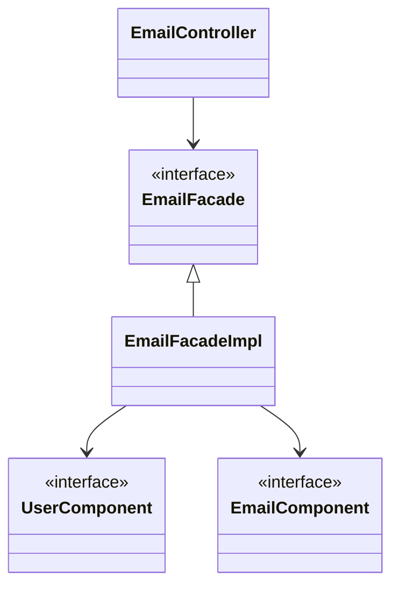

# E-COMMERCE REST API

## Como ejecutarlo

## Descripción

Este proyecto es una API REST en desarrollo para un sistema de e-commerce.

## Tecnologías

- **Java**
    - **Spring Boot**: Framework para el desarrollo de aplicaciones web.
        - **Spring Data JPA**: Framework para el mapeo objeto-relacional ( Hibernate ).
        - **Spring Security**: Modulo para la seguridad de la aplicación (Autenticación, Autorización, Vulnerabilidades,
          etc).
        - **Spring Web**: Modulo para soporte de aplicaciones web (MVC, REST, etc).
    - **Testing**
        - **JUnit**: Framework para realizar pruebas unitarias, de integración, etc.
        - **AssertJ**: Framework para realizar aserciones.
        - **Mockito**: Framework para hacer mock de dependencias.
        - **Spring Boot Test**: Framework para realizar pruebas de integración.

- **Base de datos**
    - **PostgreSQL**: RDBMS.
    - **Cloud Storage for Firebase**: Servicio cloud para almacenar archivos binarios (imagenes, videos, etc).

- **Documentación**
    - **OpenAPI Specification**: Especificación estandar para documentar APIs HTTP.

## Estructura del proyecto

### Simple

#### Modulos y su funcionalidad:

- **_bootstrapping_**:
    - Llevantamiento de la aplicacion
    - Configuracion de entornos
        - produccion
        - desarrollo
        - pruebas
    - Mapeo de codigos de error
    - Entrada y salida HTTP
    - Pruebas Funcionales

- **_application_**:
    - Logica de negocio
        - Coordinacion entre los modulos (de bajo nivel)

- **_user_**:
    - Gestion de usuarios
        - Creacion
        - Actualizacion
        - Eliminacion
        - Consultas en general

- **_product_**:
    - Gestion de productos
        - Creacion
        - Actualizacion
        - Eliminacion
        - Consultas en general

- **_email_**:
    - Envio de emails
    - Gestion de codigo de verificacion

- **_security_**:
    - Autenticacion
    - Autorizacion
    - Proteccion contra vulnerabilidades
    - Gestion de sesiones

- **_payment_**:
    - Gestion de pagos
        - ~~Integracion con pasarelas de pago~~
        - Creditos internos

- **_order_**:
    - Gestion de ordenes

- **_file_**:
    - Gestion de archivos
        - imagenes
            - de productos

- **_deposit_**:
    - Gestion de depositos
        - Recarga de creditos internos por transferencia bancaria

- **_cart_**:
    - Gestion de carritos de compras

### Ejemplo de flujo de aplicacion

- Diagrama de clases de [EmailController](bootstrapping/src/main/java/org/cris6h16/Controllers/EmailController.java)

- Diagrama de clases
  de [UserController](bootstrapping/src/main/java/org/cris6h16/Controllers/UserController.java) & [AuthenticationController](bootstrapping/src/main/java/org/cris6h16/Controllers/AuthenticationController.java) (
  completo)

PD:

- Por hacerlo mas legible, Estos diagramas excluyen:
    - _DTOs_: Objetos de entrada y salida HTTP
    - _Inputs_: Objetos de entradas a componentes
    - _Outputs_:Objetos de salida de componentes

## Requisitos Funcionales Cumplidos

DOCS INCOMPLETOS desde aqui

## Dudas que probablemente tengas

### Aplicación

### Desarrollo

[//]: # (## Acerca del autor)

